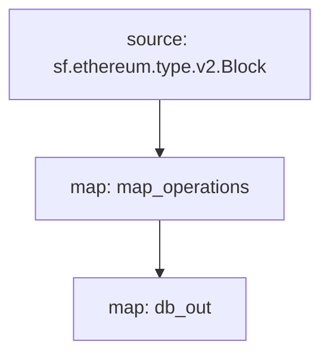

# Inscriptions Substreams

> Substreams for Inscriptions.

## Quickstart

```
$ gh repo clone pinax-network/substreams-inscriptions
$ cd substreams-inscriptions
$ make
$ make gui
```

## Releases

- https://github.com/pinax-network/substreams-inscriptions/releases

## References

- [Avascriptions](https://docs.avascriptions.com/)
- [IERC 20](https://www.ierc20.com/)

### Mermaid Graph



### Modules

```yaml
Package name: inscriptions
Version: v0.1.0
Doc: Inscriptions
Modules:
----
Name: map_operations
Initial block: 0
Kind: map
Input: source: sf.ethereum.type.v2.Block
Output Type: proto:inscriptions.types.v1.Operations
Hash: 521f8cba3fec40e7efa55971262ecb3ed5933d6b
Doc:  Extracts Inscription operation events from the block

Name: db_out
Initial block: 0
Kind: map
Input: map: map_operations
Output Type: proto:sf.substreams.sink.database.v1.DatabaseChanges
Hash: a485e5e3b9b529a86a35d0c0ef05ed992dcf2768

Network: avalanche

Sink config:
----
type: sf.substreams.sink.sql.v1.Service
configs:
- schema: (2295 bytes) MD5SUM: 66f73da2b832ecf270e501fa1fc2305a [LOADED_FILE]
- dbt_config:
  - files: (empty) [ZIPPED_FOLDER]
  - run_interval_seconds: 0
  - enabled: false
- hasura_frontend:
  - enabled: false
- postgraphile_frontend:
  - enabled: false
- engine: 2
- rest_frontend:
  - enabled: false
```
