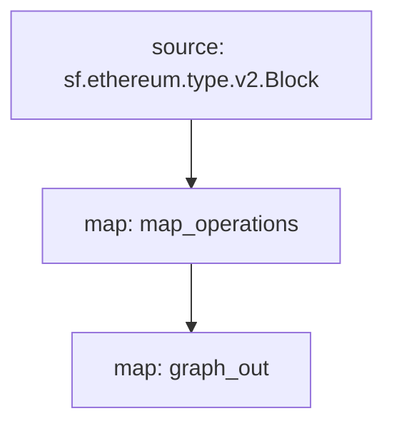

# Inscriptions Substreams

> Substreams for Inscriptions.

## Quickstart

```
$ gh repo clone pinax-network/substreams-inscriptions
$ cd substreams-inscriptions
$ make
$ make gui
```

## Releases

- https://github.com/pinax-network/substreams-inscriptions/releases

## References

- [Avascriptions](https://docs.avascriptions.com/)
- [IERC 20](https://www.ierc20.com/)

### Mermaid Graph



Here is a quick link to see the graph:

https://mermaid.live/edit#pako:eJx0jk1qxDAMRq9itM6Yod15dmVu0O7iEISt_ND4B0cqhJC7FxJIIXSW-ng8vRVc8gQG-oJ5UF_Ph41KBcxtylSQxxTnOmA2l63ZubnTxAMVkqB5yaR_3vTHlNx3PScpjsxrolG3m5X7_Z0u5l2817RJ-Ph9ns0_eX-iE3vYCBUEKgFHDwZWCzxQIAvGgqcOZWILG1SAwulziQ4MF6EKJHtkeo7YFwzHuP0GAAD__76yZ_w

### Modules

```yaml
Package name: inscriptions
Version: v0.1.0
Doc: Inscriptions
Modules:
----
Name: map_operations
Initial block: 0
Kind: map
Output Type: proto:inscriptions.types.v1.OperationsEvent
Hash: 0e76f8667de427579ecc0a062b9362f2da888d77
Doc:  Extracts 'Operations' events from the block

Name: graph_out
Initial block: 0
Kind: map
Output Type: proto:sf.substreams.sink.entity.v1.EntityChanges
Hash: 9b4c9974527d76debb932e5412679f3010079731
```
