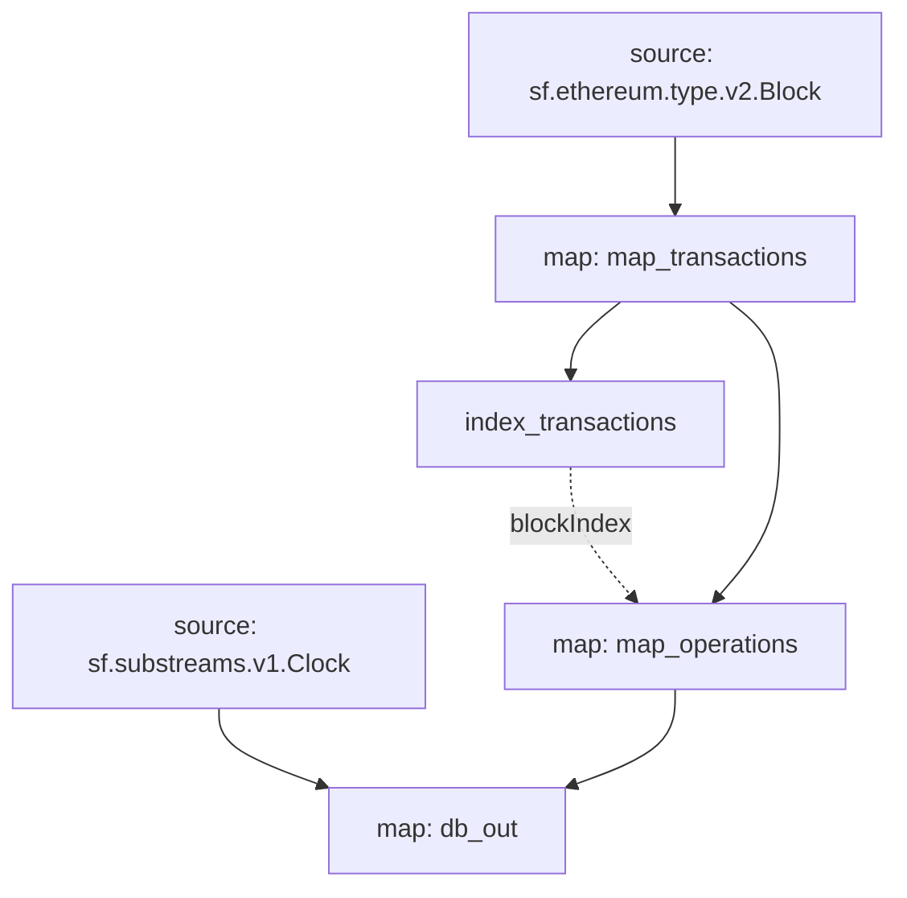

# Inscriptions Substreams

> Substreams for Inscriptions.

## Quickstart

```
$ gh repo clone pinax-network/substreams-inscriptions
$ cd substreams-inscriptions
$ make
$ make gui
```

## Releases

- https://github.com/pinax-network/substreams-inscriptions/releases

## References

- [Avascriptions](https://docs.avascriptions.com/)
- [IERC 20](https://www.ierc20.com/)

### Mermaid Graph



### Modules

```yaml
Package name: inscriptions
Version: v0.1.0
Doc: Inscriptions
Modules:
----
Name: index_transactions
Initial block: 0
Kind: index
Input: map: map_transactions
Output Type: proto:sf.substreams.index.v1.Keys
Hash: 78864d10ee5849a45d8bd7d38ccb2a545f712281

Name: map_transactions
Initial block: 0
Kind: map
Input: source: sf.ethereum.type.v2.Block
Output Type: proto:inscriptions.types.v1.Transactions
Hash: 5fd86381d6bd2eb3284c70c71ed50ffe01dd83e9
Doc:  Extracts Inscription transactions from the block

Name: map_operations
Initial block: 0
Kind: map
Input: map: map_transactions
Block Filter: (using *index_transactions*): `&{inscriptions}`
Output Type: proto:inscriptions.types.v1.Operations
Hash: 507762a25fc2a9f4ad3d79760b9d41655564cee8
Doc:  Extracts Inscription operation events from the block

Name: db_out
Initial block: 0
Kind: map
Input: source: sf.substreams.v1.Clock
Input: map: map_operations
Output Type: proto:sf.substreams.sink.database.v1.DatabaseChanges
Hash: 8f2aba00094ab3b8905e1827151647d3de6cbdb6

Network: avalanche

Networks:
  avalanche:
    Initial Blocks:
      - balance_changes:db_out: 31918263

  mainnet:
    Initial Blocks:
      - balance_changes:db_out: 17502296

  eosevm:
    Initial Blocks:
      - balance_changes:db_out: 21385639

Sink config:
----
type: sf.substreams.sink.sql.v1.Service
configs:
- schema: (2199 bytes) MD5SUM: c0f1cc0d5bc84410155154545fd0ac32 [LOADED_FILE]
- dbt_config:
  - files: (empty) [ZIPPED_FOLDER]
  - run_interval_seconds: 0
  - enabled: false
- wire_protocol_access: false
- hasura_frontend:
  - enabled: false
- postgraphile_frontend:
  - enabled: false
- pgweb_frontend:
  - enabled: false
- engine: 2
```
